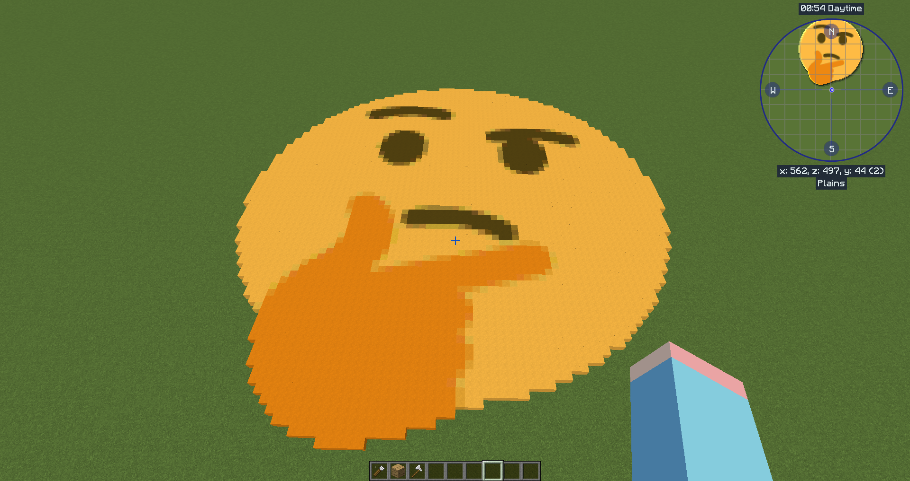

# Pixgen

###### Generate pixel art from image for Minecraft.


## Usage

```shell
$ python pixgen.py -t -i examples/thinking.png -o examples/thinking
```

The output file is in schematic format, you can import it with [WorldEdit](https://worldedit.enginehub.org/) using `//schem load <name>`


## TODO

- [ ] Fix transparent bug
- [ ] Resizing
- [x] Get up earlier in the next morning

## Screenshot

